<p align="center">
  
  
  
  
  
  
  
  
</p>

<h1 align="center">🍽️ TNFood — Architecture Case Study</h1>

<p align="center">
  <strong>Plateforme SaaS multi-tenant de digitalisation opérationnelle pour la restauration en Tunisie.</strong>
</p>

<p align="center">
  <em>Étude de cas d'architecture — Product Engineering · Multi-Tenancy · Row-Level Security</em>
</p>

---

## 📑 Table des matières

- [Aperçu](#-aperçu)
- [Contexte produit](#-contexte-produit)
- [Pourquoi ce dépôt existe](#-pourquoi-ce-dépôt-existe)
- [Contexte de production](#-contexte-de-production)
- [Objectifs de la plateforme](#-objectifs-de-la-plateforme)
- [Stack technique](#-stack-technique)
- [Points forts de l'architecture](#-points-forts-de-larchitecture)
- [Conception multi-tenant](#-conception-multi-tenant)
- [Approche Row-Level Security (RLS)](#-approche-row-level-security-rls)
- [Architecture haut niveau](#-architecture-haut-niveau)
- [Capacités clés de la plateforme](#-capacités-clés-de-la-plateforme)
- [Rôles utilisateur et permissions](#-rôles-utilisateur-et-permissions)
- [Paiement par Ticket Restaurant](#-paiement-par-ticket-restaurant)
- [Focus ingénierie](#-focus-ingénierie)
- [Notes d'architecture](#-notes-darchitecture)
- [Périmètre du dépôt](#-périmètre-du-dépôt)
- [Captures d'écran / Visuels](#-captures-décran--visuels)
- [Documentation complémentaire](#-documentation-complémentaire)
- [Liens publics](#-liens-publics)
- [Avertissement](#-avertissement)

---

## 🔍 Aperçu

**TNFood** est une plateforme SaaS verticale conçue pour la digitalisation complète du secteur de la restauration en Tunisie. Elle offre à chaque restaurant partenaire un écosystème opérationnel complet : tableau de bord de gestion, application POS mobile, site de commande en ligne pour les clients finaux, et un dashboard de supervision global pour l'opérateur de la plateforme.

Le système est construit autour d'une architecture **multi-tenant** robuste où chaque restaurant dispose de son propre espace de données isolé, tout en partageant une infrastructure commune. L'isolation des données repose sur **Row-Level Security (RLS)** au niveau PostgreSQL, garantissant un cloisonnement natif et vérifiable côté base de données.

Ce dépôt public ne contient **pas le code source privé** du projet. Il sert de vitrine technique documentant l'architecture, les choix d'ingénierie et les modules fonctionnels de la plateforme.

---

## 🎯 Contexte produit

### Le problème

Le marché de la restauration en Tunisie fait face à des défis opérationnels concrets :

- **Fragmentation des outils** : les restaurateurs jonglent entre caisses manuelles, cahiers de commandes, messageries WhatsApp et fichiers Excel pour gérer leurs opérations quotidiennes.
- **Absence de visibilité numérique** : la majorité des restaurants n'ont pas de présence en ligne avec système de commande intégré.
- **Gestion opérationnelle limitée** : pas de suivi des performances, d'analytique client, ou de gestion centralisée des menus et des commandes.

### La solution

TNFood fournit une plateforme métier complète qui couvre l'ensemble de la chaîne opérationnelle d'un restaurant :

| Besoin métier | Solution TNFood |
|---|---|
| Gestion du menu et des stocks | Dashboard admin avec CRUD produits, catégories, suppléments |
| Prise de commande en salle et comptoir | Application POS mobile offline-first |
| Commande en ligne (takeaway, delivery, dine-in) | Site client Next.js avec panier et checkout |
| Suivi des commandes en temps réel | SSE + WebSocket notifications |
| Analytique et performance | Dashboard avec KPIs, tendances, heures de pointe |
| Gestion de la caisse | Module caisse avec sessions ouverture/fermeture |
| Gestion multi-établissements | Architecture multi-tenant avec isolation complète |
| Supervision de la plateforme | Dashboard super-admin avec BI intégrée |

---

## 🤔 Pourquoi ce dépôt existe

Ce dépôt a pour vocation de :

1. **Documenter et partager** les décisions d'architecture et d'ingénierie du projet TNFood dans un cadre public.
2. **Servir de case study** concret sur la construction d'une plateforme SaaS multi-tenant avec isolation par RLS, dans un contexte de production réel.
3. **Illustrer** comment un mono-repo TypeScript full-stack peut être structuré pour supporter plusieurs surfaces client (admin, client web, POS mobile, platform dashboard) autour d'une API centralisée.
4. **Offrir un aperçu technique** destiné aux pairs, recruteurs et leads techniques souhaitant évaluer le niveau d'ingénierie du projet.

> **Ce dépôt ne contient pas le code source complet.** Il présente l'architecture, les schémas, les patterns utilisés et les choix d'ingénierie qui sous-tendent la plateforme. Le code source reste dans un dépôt privé.

---

## 🚀 Contexte de production

TNFood est un projet **en production** déployé sur infrastructure VPS :

| Aspect | Détail |
|---|---|
| **Statut** | En production, utilisé par des restaurants partenaires |
| **Déploiement** | Docker Compose multi-services sur VPS dédié |
| **Infrastructure** | PostgreSQL 15 · Redis 7 · Nginx reverse proxy · MinIO (stockage objets) |
| **Domaines** | Sous-domaines dédiés par service (API, Admin, Client, Platform) |
| **CI/CD** | Build Docker automatisé par service |
| **Monitoring** | Health checks applicatifs + healthchecks infrastructure |
| **Données** | Isolation totale par tenant via RLS au niveau base de données |

Le système gère plusieurs restaurants en parallèle, chacun avec ses propres utilisateurs, menus, commandes, clients et configurations, sur une seule instance applicative.

### Architecture de déploiement

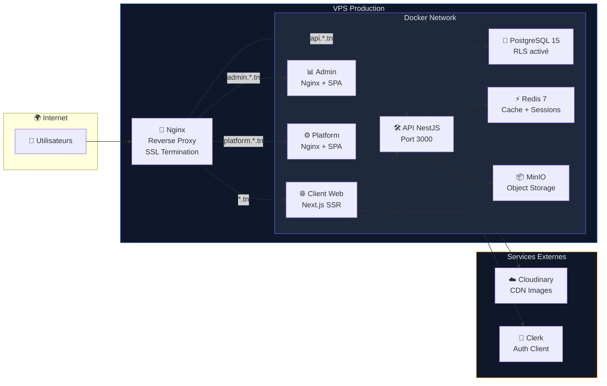
```mermaid
graph LR
    subgraph Internet["🌍 Internet"]
        U["👤 Utilisateurs"]
    end

    subgraph VPS["VPS Production"]
        NG["🔀 Nginx\nReverse Proxy\nSSL Termination"]

        subgraph DockerNetwork["Docker Network"]
            API["🛠️ API NestJS\nPort 3000"]
            CW["🌐 Client Web\nNext.js SSR"]
            ADM["📊 Admin\nNginx + SPA"]
            PLT["⚙️ Platform\nNginx + SPA"]
            PG["🐘 PostgreSQL 15\nRLS activé"]
            RD["⚡ Redis 7\nCache + Sessions"]
            MO["📦 MinIO\nObject Storage"]
        end
    end

    subgraph External["Services Externes"]
        CLO["☁️ Cloudinary\nCDN Images"]
        CLK["🔐 Clerk\nAuth Client"]
    end

    U --> NG
    NG -->|"api.*.tn"| API
    NG -->|"*.tn"| CW
    NG -->|"admin.*.tn"| ADM
    NG -->|"platform.*.tn"| PLT

    API --> PG
    API --> RD
    API --> MO
    API --> CLO
    CW --> CLK
    CW --> API

    style VPS fill:#0f172a,stroke:#3b82f6,color:#e2e8f0
    style DockerNetwork fill:#1e293b,stroke:#6366f1,color:#e2e8f0
    style External fill:#0f172a,stroke:#f59e0b,color:#e2e8f0
```

---

## 🏁 Objectifs de la plateforme

- **Digitaliser** la gestion opérationnelle complète d'un restaurant (menu, commandes, caisse, livraisons, analytique)
- **Garantir l'isolation** stricte des données entre restaurants partenaires
- **Supporter le mode offline** pour la prise de commande POS en environnement à connectivité variable
- **Fournir une expérience client premium** de commande en ligne avec authentification, panier persistant et suivi en temps réel
- **Centraliser la supervision** de l'ensemble de la plateforme pour l'opérateur (MRR, churn, cohortes, entonnoir de conversion)
- **Évoluer** vers un modèle SaaS scalable (plans FREE / BASIC / PREMIUM)

---

## 🛠️ Stack technique

### Backend

| Technologie | Rôle |
|---|---|
| **TypeScript** | Langage principal — typage strict sur l'ensemble du codebase |
| **NestJS 10** | Framework backend — architecture modulaire, injection de dépendances, guards, interceptors |
| **Prisma 5** | ORM — schema-first, migrations, type safety |
| **PostgreSQL 15** | Base de données relationnelle — RLS, fonctions SQL, indexation |
| **Redis 7** | Cache applicatif, rate limiting, sessions |
| **Passport.js** | Authentification — stratégies JWT + Local |
| **Socket.IO** | WebSocket — notifications temps réel |
| **Swagger/OpenAPI** | Documentation API auto-générée |
| **Cloudinary** | Stockage et transformation d'images |

### Frontend

| Technologie | Rôle |
|---|---|
| **Next.js 14** | Client web — App Router, SSR, middleware auth |
| **React 19 + Vite** | Admin dashboard + Platform dashboard — SPA performantes |
| **TailwindCSS** | Styling utilitaire |
| **shadcn/ui** | Composants UI accessibles et personnalisables |
| **TanStack Query v5** | Gestion de l'état serveur, cache, invalidation |
| **Zustand** | State management client léger (panier, auth, sync) |
| **Clerk** | Auth client web (OAuth, Magic Link) |
| **Recharts** | Visualisation de données et graphiques |
| **Zod** | Validation de schémas côté client |

### Mobile

| Technologie | Rôle |
|---|---|
| **React Native + Expo** | Application POS mobile cross-platform |
| **Zustand** | Store offline-first avec persistence |
| **Synchronisation batch** | Queue offline avec retry exponentiel et idempotence |

### Infrastructure

| Technologie | Rôle |
|---|---|
| **Docker + Docker Compose** | Containerisation et orchestration multi-services |
| **Nginx** | Reverse proxy, terminaison SSL, routage sous-domaines |
| **MinIO** | Stockage objets compatible S3 |

---

## 🏗️ Points forts de l'architecture

### Organisation monorepo

Le projet est structuré en **monorepo** avec `pnpm workspaces`, permettant le partage de types TypeScript et de configurations entre les différents packages :

```
tnfood/
├── backend/                  # API NestJS — 18 modules métier
│   ├── src/modules/          # auth, orders, products, analytics, platform...
│   ├── src/shared/           # interceptors, guards, decorators, filters
│   └── prisma/               # schema, migrations, RLS policies
│
├── frontend/
│   ├── admin/                # Dashboard restaurateur (React + Vite)
│   ├── client-web/           # Site commande client (Next.js 14)
│   └── platform-dashboard/   # Super-admin BI (React + Vite)
│
├── mobile/
│   └── pos-app/              # POS offline-first (React Native + Expo)
│
└── shared/                   # Types TypeScript partagés
```

### Clean Architecture côté backend

Chaque module backend suit une architecture en couches stricte :

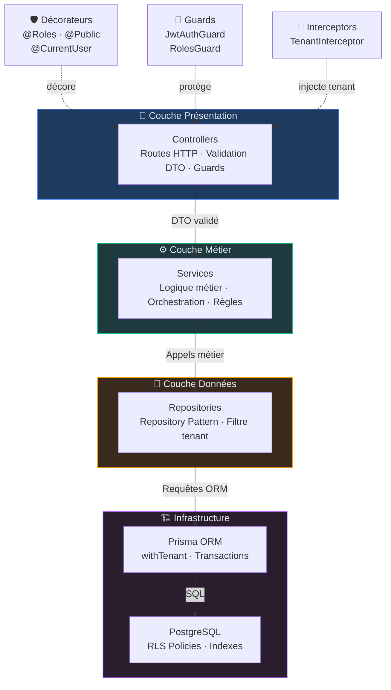
```mermaid
graph TB
    subgraph Presentation["🎯 Couche Présentation"]
        CTRL["Controllers\nRoutes HTTP · Validation DTO · Guards"]
    end

    subgraph Business["⚙️ Couche Métier"]
        SVC["Services\nLogique métier · Orchestration · Règles"]
    end

    subgraph DataAccess["💾 Couche Données"]
        REPO["Repositories\nRepository Pattern · Filtre tenant"]
    end

    subgraph Infrastructure["🏗️ Infrastructure"]
        PRISMA["Prisma ORM\nwithTenant · Transactions"]
        PGSQL["PostgreSQL\nRLS Policies · Indexes"]
    end

    CTRL -->|"DTO validé"| SVC
    SVC -->|"Appels métier"| REPO
    REPO -->|"Requêtes ORM"| PRISMA
    PRISMA -->|"SQL"| PGSQL

    DEC["🛡️ Décorateurs\n@Roles · @Public\n@CurrentUser"]
    GRD["🔐 Guards\nJwtAuthGuard\nRolesGuard"]
    INT["🏢 Interceptors\nTenantInterceptor"]

    DEC -.->|"décore"| CTRL
    GRD -.->|"protège"| CTRL
    INT -.->|"injecte tenant"| CTRL

    style Presentation fill:#1e3a5f,stroke:#3b82f6,color:#e2e8f0
    style Business fill:#1e3a3f,stroke:#10b981,color:#e2e8f0
    style DataAccess fill:#3a2a1e,stroke:#f59e0b,color:#e2e8f0
    style Infrastructure fill:#2a1e2e,stroke:#a855f7,color:#e2e8f0
```

- **Controllers** : gestion HTTP, validation DTO, guards d'authentification
- **Services** : logique métier pure, orchestration, pas de dépendance directe à Prisma
- **Repositories** : abstraction d'accès aux données via le Repository Pattern, filtre automatique par `restaurantId`
- **DTOs** : validation entrante (`class-validator`) et formatage sortant standardisé

### Sécurité multi-couche

- **JWT** avec access token (courte durée) et refresh token (longue durée)
- **Guards globaux** : `JwtAuthGuard` + `RolesGuard` appliqués automatiquement
- **Hiérarchie de rôles** : `SUPERADMIN > OWNER > ADMIN > STAFF > DRIVER`
- **Décorateurs personnalisés** : `@CurrentUser`, `@CurrentRestaurantId`, `@Public`, `@Roles`
- **TenantInterceptor** : extraction et vérification du contexte tenant sur chaque requête authentifiée
- **Rate limiting** : par endpoint et global, via Redis
- **Validation whitelist** : suppression automatique des propriétés non déclarées dans les DTOs

#### Flux d'authentification par surface

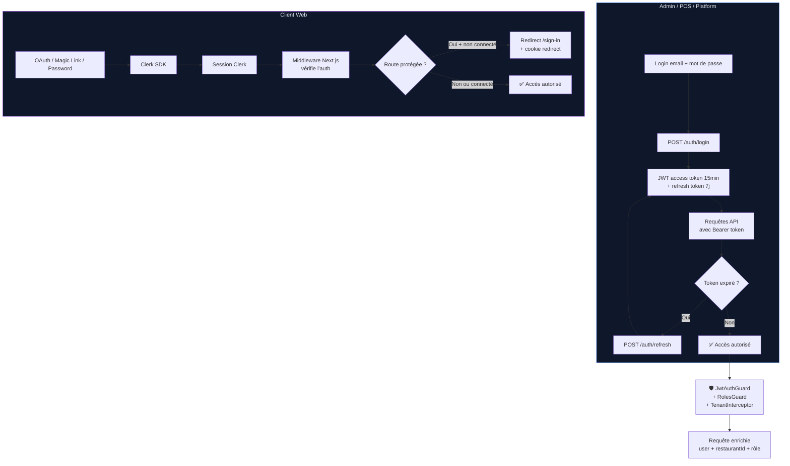
```mermaid
flowchart TB
    subgraph AdminPOS["Admin / POS / Platform"]
        A1["Login email + mot de passe"] --> A2["POST /auth/login"]
        A2 --> A3["JWT access token 15min\n+ refresh token 7j"]
        A3 --> A4["Requêtes API\navec Bearer token"]
        A4 --> A5{"Token expiré ?"}
        A5 -->|"Oui"| A6["POST /auth/refresh"]
        A6 --> A3
        A5 -->|"Non"| A7["✅ Accès autorisé"]
    end

    subgraph ClientWeb["Client Web"]
        B1["OAuth / Magic Link / Password"] --> B2["Clerk SDK"]
        B2 --> B3["Session Clerk"]
        B3 --> B4["Middleware Next.js\nvérifie l'auth"]
        B4 --> B5{"Route protégée ?"}
        B5 -->|"Oui + non connecté"| B6["Redirect /sign-in\n+ cookie redirect"]
        B5 -->|"Non ou connecté"| B7["✅ Accès autorisé"]
    end

    A7 --> GUARD["🛡️ JwtAuthGuard\n+ RolesGuard\n+ TenantInterceptor"]
    GUARD --> RESULT["Requête enrichie\nuser + restaurantId + rôle"]

    style AdminPOS fill:#0f172a,stroke:#3b82f6,color:#e2e8f0
    style ClientWeb fill:#0f172a,stroke:#a855f7,color:#e2e8f0
```

---

## 🔐 Conception multi-tenant

### Pourquoi le multi-tenant est central

Dans le contexte de TNFood, chaque restaurant est un **tenant** indépendant. Tous les tenants partagent la même instance applicative et la même base de données, mais leurs données doivent être **strictement isolées** :

- Un restaurant ne doit jamais voir les commandes, produits, clients ou données d'un autre restaurant.
- L'API doit garantir cette isolation **indépendamment du code applicatif** (defense in depth).
- Le modèle doit rester **scalable** : ajouter un restaurant ne nécessite ni base de données supplémentaire, ni déploiement dédié.

### Stratégie d'isolation

TNFood utilise une approche **shared-database, shared-schema** avec isolation logique :

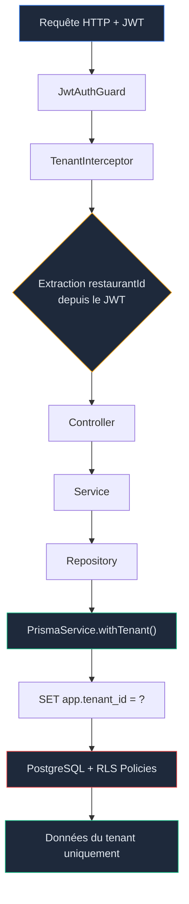
```mermaid
flowchart TD
    A["Requête HTTP + JWT"] --> B["JwtAuthGuard"]
    B --> C["TenantInterceptor"]
    C --> D{"Extraction restaurantId\ndepuis le JWT"}
    D --> E["Controller"]
    E --> F["Service"]
    F --> G["Repository"]
    G --> H["PrismaService.withTenant()"]
    H --> I["SET app.tenant_id = ?"]
    I --> J["PostgreSQL + RLS Policies"]
    J --> K["Données du tenant uniquement"]

    style A fill:#1e293b,stroke:#3b82f6,color:#e2e8f0
    style D fill:#1e293b,stroke:#f59e0b,color:#e2e8f0
    style H fill:#1e293b,stroke:#10b981,color:#e2e8f0
    style J fill:#1e293b,stroke:#ef4444,color:#e2e8f0
    style K fill:#1e293b,stroke:#10b981,color:#e2e8f0
```

**Trois niveaux de protection :**

1. **Niveau applicatif** : chaque requête passe par le `TenantInterceptor` qui extrait le `restaurantId` du JWT et l'injecte dans le contexte de la requête.
2. **Niveau repository** : le Repository Pattern filtre systématiquement par `restaurantId` dans chaque requête Prisma.
3. **Niveau base de données** : les politiques RLS PostgreSQL vérifient que `restaurant_id = app.current_tenant()` sur chaque opération (SELECT, INSERT, UPDATE, DELETE).

Cette approche **defense in depth** garantit que même si un bug applicatif oublie de filtrer par tenant, la base de données bloque l'accès aux données non autorisées.

---

## 🛡️ Approche Row-Level Security (RLS)

### Principes

Le RLS est implémenté au niveau PostgreSQL via un schéma dédié `app` contenant les fonctions de gestion du tenant courant :

- **`app.set_current_tenant(tenant_id)`** : positionne le tenant actif pour la session/transaction courante via `SET CONFIG`.
- **`app.current_tenant()`** : retourne le tenant actif, ou `NULL` si non défini.

Chaque table contenant des données tenant-scoped dispose de **politiques RLS** pour les quatre opérations :

| Opération | Politique |
|---|---|
| `SELECT` | `WHERE restaurant_id = app.current_tenant()` |
| `INSERT` | `WITH CHECK (restaurant_id = app.current_tenant())` |
| `UPDATE` | `WHERE restaurant_id = app.current_tenant()` |
| `DELETE` | `WHERE restaurant_id = app.current_tenant()` |

### Tables protégées par RLS

- `restaurants`
- `users`
- `categories`
- `products`
- `orders`
- `customers`
- `order_items`
- `reviews`
- `favorites`
- `supplements`
- `cash_register_sessions`
- `ticket_credit_codes`

### Modèle de données simplifié

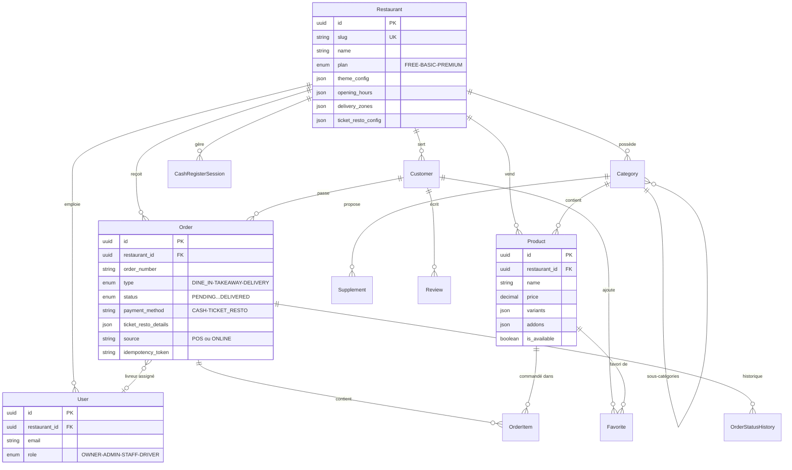
```mermaid
erDiagram
    Restaurant ||--o{ User : "emploie"
    Restaurant ||--o{ Category : "possède"
    Restaurant ||--o{ Product : "vend"
    Restaurant ||--o{ Order : "reçoit"
    Restaurant ||--o{ Customer : "sert"
    Restaurant ||--o{ CashRegisterSession : "gère"

    Category ||--o{ Product : "contient"
    Category ||--o{ Supplement : "propose"
    Category ||--o{ Category : "sous-catégories"

    Customer ||--o{ Order : "passe"
    Customer ||--o{ Review : "écrit"
    Customer ||--o{ Favorite : "ajoute"

    Order ||--o{ OrderItem : "contient"
    Order ||--o{ OrderStatusHistory : "historique"
    Order }o--o| User : "livreur assigné"

    Product ||--o{ OrderItem : "commandé dans"
    Product ||--o{ Favorite : "favori de"

    Restaurant {
        uuid id PK
        string slug UK
        string name
        enum plan "FREE-BASIC-PREMIUM"
        json theme_config
        json opening_hours
        json delivery_zones
        json ticket_resto_config
    }

    User {
        uuid id PK
        uuid restaurant_id FK
        string email
        enum role "OWNER-ADMIN-STAFF-DRIVER"
    }

    Order {
        uuid id PK
        uuid restaurant_id FK
        string order_number
        enum type "DINE_IN-TAKEAWAY-DELIVERY"
        enum status "PENDING...DELIVERED"
        string payment_method "CASH-TICKET_RESTO"
        json ticket_resto_details
        string source "POS ou ONLINE"
        string idempotency_token
    }

    Product {
        uuid id PK
        uuid restaurant_id FK
        string name
        decimal price
        json variants
        json addons
        boolean is_available
    }
```

> **Note** : toutes les tables contiennent une colonne `restaurant_id` servant de clé de partitionnement logique pour le RLS. Ce champ est la pierre angulaire de l'isolation multi-tenant.

### Intégration avec Prisma

Le helper `PrismaService.withTenant(restaurantId, callback)` encapsule chaque opération tenant-scoped dans une transaction PostgreSQL :

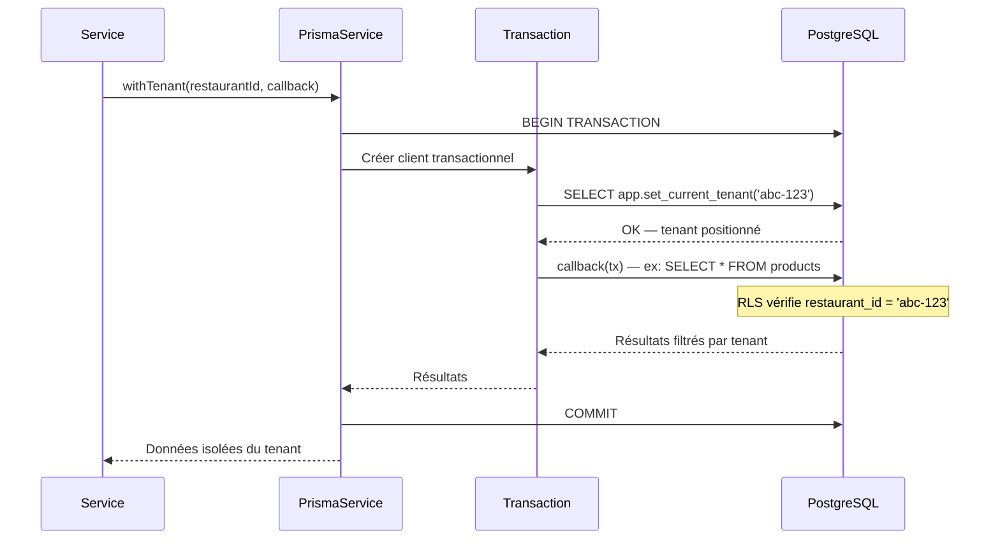
```mermaid
sequenceDiagram
    participant S as Service
    participant P as PrismaService
    participant TX as Transaction
    participant DB as PostgreSQL

    S->>P: withTenant(restaurantId, callback)
    P->>DB: BEGIN TRANSACTION
    P->>TX: Créer client transactionnel
    TX->>DB: SELECT app.set_current_tenant('abc-123')
    DB-->>TX: OK — tenant positionné
    TX->>DB: callback(tx) — ex: SELECT * FROM products
    Note over DB: RLS vérifie restaurant_id = 'abc-123'
    DB-->>TX: Résultats filtrés par tenant
    TX-->>P: Résultats
    P->>DB: COMMIT
    P-->>S: Données isolées du tenant
```

Ce pattern garantit que le contexte tenant est **toujours positionné avant toute opération de données**, et qu'il est **limité à la portée de la transaction**.

---

## 📐 Architecture haut niveau

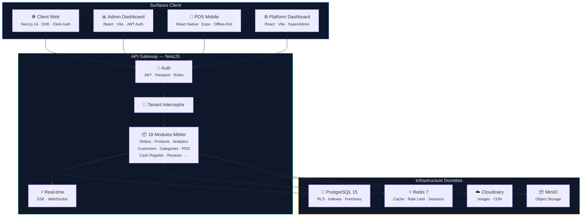
```mermaid
graph TB
    subgraph Clients["Surfaces Client"]
        CW["🌐 Client Web<br/><small>Next.js 14 · SSR · Clerk Auth</small>"]
        AD["📊 Admin Dashboard<br/><small>React · Vite · JWT Auth</small>"]
        POS["📱 POS Mobile<br/><small>React Native · Expo · Offline-first</small>"]
        PD["⚙️ Platform Dashboard<br/><small>React · Vite · SuperAdmin</small>"]
    end

    subgraph API["API Gateway — NestJS"]
        AUTH["🔑 Auth<br/><small>JWT · Passport · Roles</small>"]
        TI["🏢 Tenant Interceptor"]
        MOD["📦 18 Modules Métier<br/><small>Orders · Products · Analytics<br/>Customers · Categories · POS<br/>Cash Register · Reviews · ...</small>"]
        RT["⚡ Real-time<br/><small>SSE · WebSocket</small>"]
    end

    subgraph Data["Infrastructure Données"]
        PG["🐘 PostgreSQL 15<br/><small>RLS · Indexes · Functions</small>"]
        RD["⚡ Redis 7<br/><small>Cache · Rate Limit · Sessions</small>"]
        CL["☁️ Cloudinary<br/><small>Images · CDN</small>"]
        MN["📦 MinIO<br/><small>Object Storage</small>"]
    end

    CW --> AUTH
    AD --> AUTH
    POS --> AUTH
    PD --> AUTH
    AUTH --> TI
    TI --> MOD
    MOD --> RT
    MOD --> PG
    MOD --> RD
    MOD --> CL
    MOD --> MN

    style Clients fill:#0f172a,stroke:#3b82f6,color:#e2e8f0
    style API fill:#0f172a,stroke:#10b981,color:#e2e8f0
    style Data fill:#0f172a,stroke:#f59e0b,color:#e2e8f0
```

---

## 📋 Capacités clés de la plateforme

### 🔄 Gestion des commandes

- **Workflow à états** avec transitions validées et historique complet
- **Sources multiples** : commandes POS (en salle), commandes en ligne (client web)
- **Types de commande** : dine-in, takeaway, delivery
- **Affectation livreur** avec suivi de position GPS
- **Notifications temps réel** via SSE et WebSocket

#### State Machine des commandes

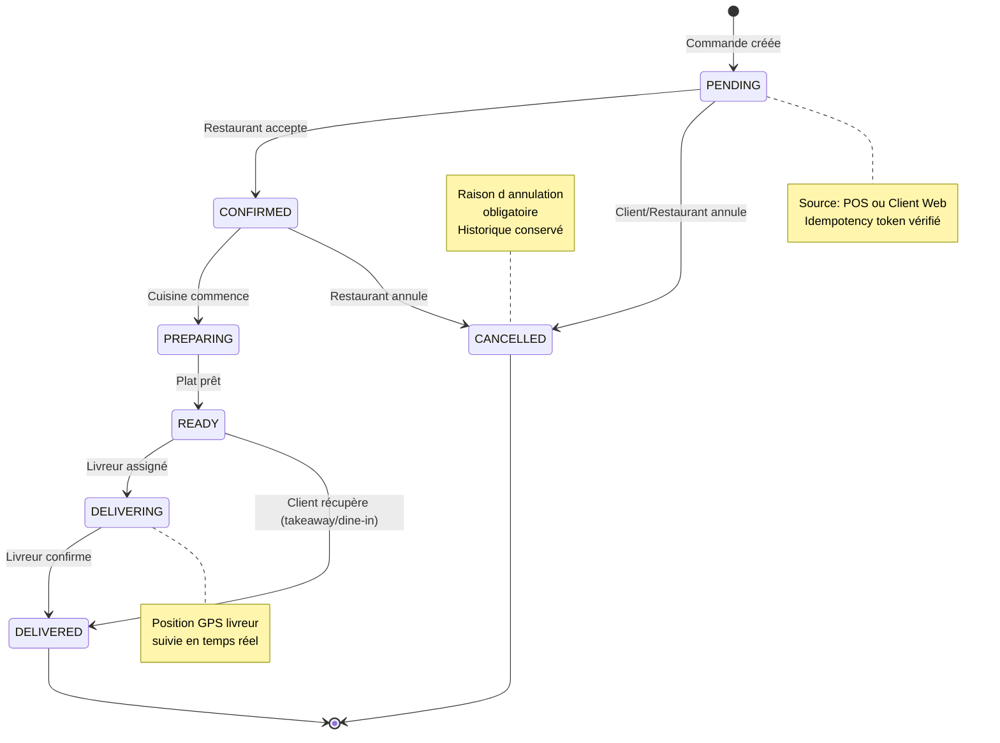
```mermaid
stateDiagram-v2
    [*] --> PENDING : Commande créée
    PENDING --> CONFIRMED : Restaurant accepte
    PENDING --> CANCELLED : Client/Restaurant annule
    CONFIRMED --> PREPARING : Cuisine commence
    CONFIRMED --> CANCELLED : Restaurant annule
    PREPARING --> READY : Plat prêt
    READY --> DELIVERING : Livreur assigné
    READY --> DELIVERED : Client récupère (takeaway/dine-in)
    DELIVERING --> DELIVERED : Livreur confirme

    CANCELLED --> [*]
    DELIVERED --> [*]

    note right of PENDING
        Source: POS ou Client Web
        Idempotency token vérifié
    end note

    note right of DELIVERING
        Position GPS livreur
        suivie en temps réel
    end note

    note left of CANCELLED
        Raison d annulation
        obligatoire
        Historique conservé
    end note
```

Chaque transition est **validée côté backend** : seules les transitions autorisées sont acceptées. L'historique complet des changements de statut est conservé dans `order_status_history` avec horodatage et identifiant de l'opérateur.

### 🚚 Flux de livraison — Traitement de commande multi-acteur

Le parcours d'une commande de type **DELIVERY** implique trois acteurs qui interagissent en temps réel via le même backend. Chaque acteur dispose de sa propre interface adaptée à son rôle.

#### Vue d'ensemble — Qui fait quoi ?

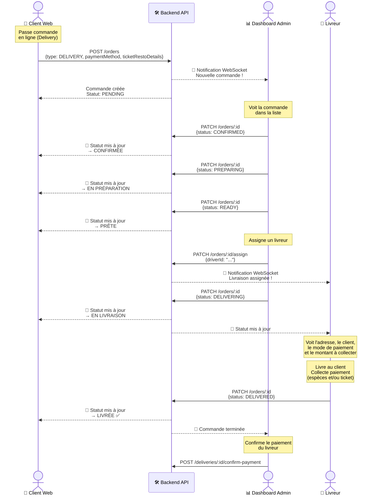
```mermaid
sequenceDiagram
    actor Client as 🛒 Client Web
    participant API as 🛠️ Backend API
    actor Dashboard as 📊 Dashboard Admin
    actor Driver as 🚴 Livreur

    Note over Client: Passe commande<br/>en ligne (Delivery)
    Client->>API: POST /orders<br/>{type: DELIVERY, paymentMethod, ticketRestoDetails}
    API-->>Dashboard: 🔔 Notification WebSocket<br/>Nouvelle commande !
    API-->>Client: Commande créée<br/>Statut: PENDING

    Note over Dashboard: Voit la commande<br/>dans la liste
    Dashboard->>API: PATCH /orders/:id<br/>{status: CONFIRMED}
    API-->>Client: 🔔 Statut mis à jour<br/>→ CONFIRMÉE

    Dashboard->>API: PATCH /orders/:id<br/>{status: PREPARING}
    API-->>Client: 🔔 Statut mis à jour<br/>→ EN PRÉPARATION

    Dashboard->>API: PATCH /orders/:id<br/>{status: READY}
    API-->>Client: 🔔 Statut mis à jour<br/>→ PRÊTE

    Note over Dashboard: Assigne un livreur
    Dashboard->>API: PATCH /orders/:id/assign<br/>{driverId: "..."}
    API-->>Driver: 🔔 Notification WebSocket<br/>Livraison assignée !

    Dashboard->>API: PATCH /orders/:id<br/>{status: DELIVERING}
    API-->>Client: 🔔 Statut mis à jour<br/>→ EN LIVRAISON
    API-->>Driver: 🔔 Statut mis à jour

    Note over Driver: Voit l'adresse, le client,<br/>le mode de paiement<br/>et le montant à collecter
    Note over Driver: Livre au client<br/>Collecte paiement<br/>(espèces et/ou ticket)
    Driver->>API: PATCH /orders/:id<br/>{status: DELIVERED}
    API-->>Client: 🔔 Statut mis à jour<br/>→ LIVRÉE ✅
    API-->>Dashboard: 🔔 Commande terminée
    
    Note over Dashboard: Confirme le paiement<br/>du livreur
    Dashboard->>API: POST /deliveries/:id/confirm-payment
```

#### 📊 Côté Dashboard Admin (Owner / Admin)

Le dashboard affiche toutes les commandes en temps réel. Pour une commande de type **Delivery**, l'admin suit ce flux :

| Étape | Action admin | Bouton affiché |
|---|---|---|
| **1. Nouvelle commande** | La commande apparaît avec une notification sonore/visuelle | **Accepter** / **Refuser** |
| **2. Confirmée** | L'admin accepte la commande | **Lancer la Préparation** |
| **3. En préparation** | La cuisine prépare les plats | **Commande Prête** |
| **4. Prête** | L'admin assigne un livreur via le sélecteur de livreurs | **Parti en livraison** |
| **5. En livraison** | Le livreur est en route — l'admin voit le statut en temps réel | — (attend le livreur) |
| **6. Livrée** | Le livreur a confirmé la livraison | **Confirmer le Paiement** |

À chaque étape, les **détails de paiement** sont visibles dans le panneau latéral de la commande :
- Mode de paiement (💵 Espèces ou 🎫 Ticket Restaurant)
- Montant du ticket et reste en espèces à récupérer si applicable

<details>
<summary>📸 Voir les captures d'écran — Flux commande côté Admin</summary>

#### Nouvelle commande reçue — Accepter ou Refuser

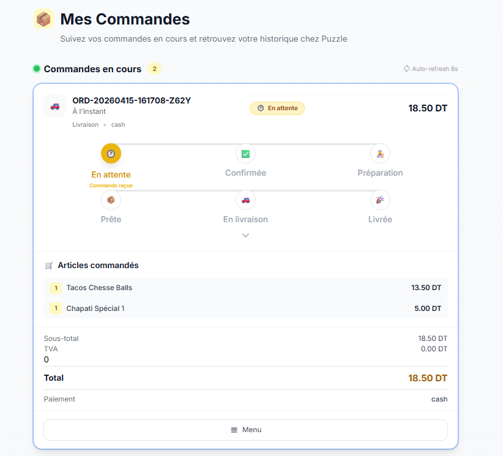

*Le dashboard affiche la nouvelle commande en temps réel avec les boutons **Accepter** et **Refuser**, ainsi que le détail complet (statut, type, client, adresse de livraison).*

#### Commande confirmée — Lancer la préparation & Assigner un livreur

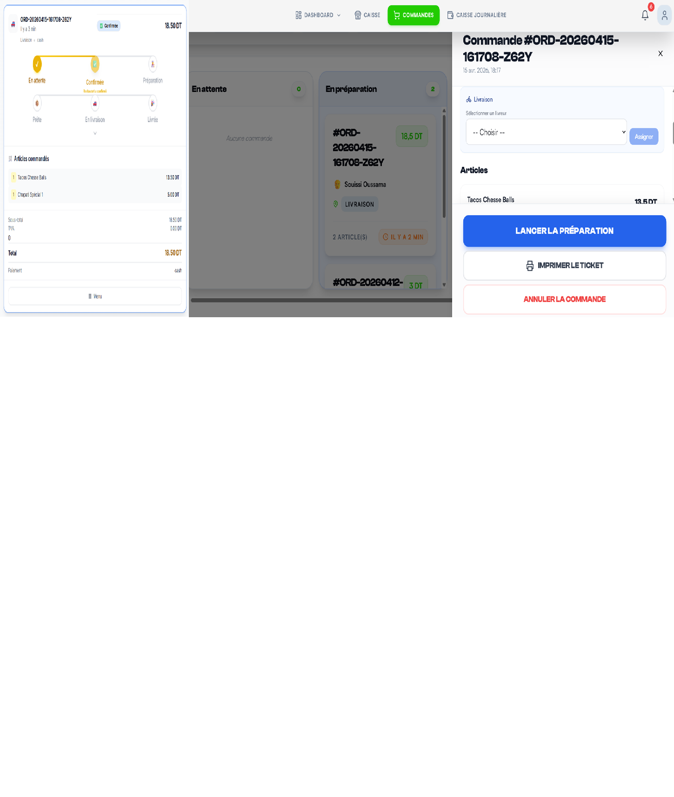

*À gauche : le suivi côté client montre le statut "Confirmée". À droite : le dashboard admin affiche le sélecteur de livreur et le bouton "Lancer la préparation".*

#### En préparation → Commande prête

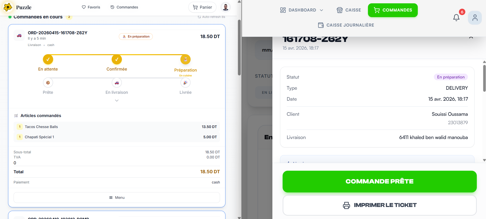

*Vue simultanée client (barre de progression "En cuisine") et admin (bouton "Commande prête" et détails de la commande).*

#### Commande prête — Assignation du livreur

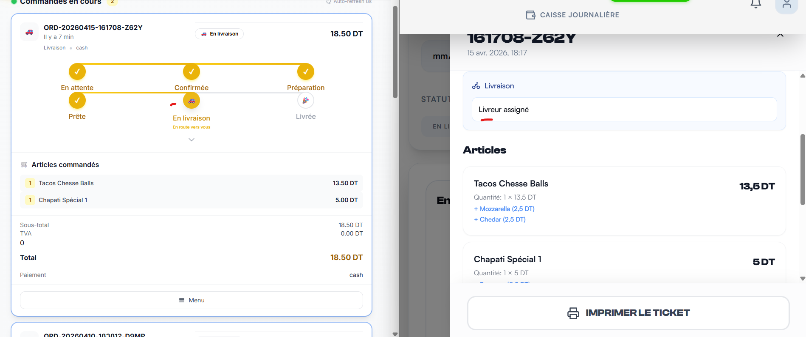

*Le sélecteur de livreur permet à l'admin de choisir parmi les livreurs disponibles. Le bouton passe à "Assigner un livreur d'abord" tant qu'aucun livreur n'est sélectionné.*

#### En livraison — Suivi en temps réel

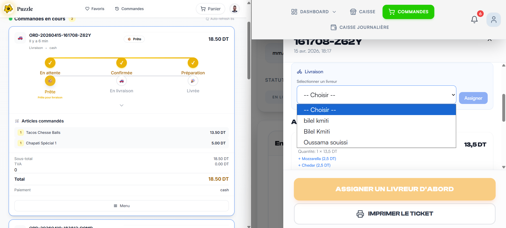

*Le client voit "En route vers vous" dans sa barre de progression. Le dashboard admin affiche le livreur assigné et le détail des articles.*

</details>

#### 🚴 Côté Livreur (Driver)

Le livreur accède à une **interface dédiée et simplifiée** (`/deliveries`) qui affiche uniquement ses commandes assignées :

| Information visible | Détail |
|---|---|
| **Numéro de commande** | Ex: `#ORD-20260410-183812-D9MP` |
| **Adresse de livraison** | Adresse complète avec lien cliquable |
| **Client** | Nom + téléphone (cliquable pour appeler) |
| **Notes de livraison** | Instructions spéciales du client |
| **Total à collecter** | Montant affiché en gros |
| **Mode de paiement** | Badge clair : `Espèces uniquement` ou `Ticket + X DT` |
| **Détails ticket** | Si Ticket Restaurant : nom du ticket, valeur, et espèces complémentaires à collecter |

Le livreur dispose d'un seul bouton d'action : **« Livré ✅ »** qui passe la commande en statut `DELIVERED`.

<details>
<summary>📸 Voir la capture d'écran — Interface livreur</summary>

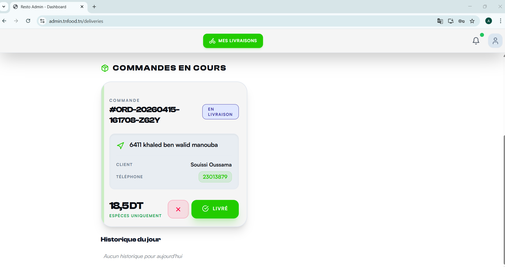

*L'interface livreur (`admin.tnfood.tn/deliveries`) affiche la commande assignée avec l'adresse de livraison, le nom et téléphone du client (cliquable), le montant à collecter (18,5 DT), le mode de paiement (Espèces uniquement) et le bouton **Livré ✅**.*

</details>

#### 🛒 Côté Client Web

Le client suit sa commande en temps réel via une **barre de progression visuelle** qui affiche les étapes :

```
En attente → Confirmée → Préparation → Prête → En livraison → Livrée ✅
```

Chaque étape est représentée par un **cercle animé** avec une icône contextuelle. L'étape active est mise en surbrillance avec le label « En route vers vous » pendant la phase de livraison.

Le client voit également :
- Le **récapitulatif de sa commande** (articles, prix, sous-total, TVA, total)
- Le **mode de paiement** choisi (💵 Espèces ou 🎫 Ticket Resto)
- La possibilité de **télécharger son reçu** en PDF

<details>
<summary>📸 Voir les captures d'écran — Suivi commande client</summary>

#### Commande en attente — Suivi initial

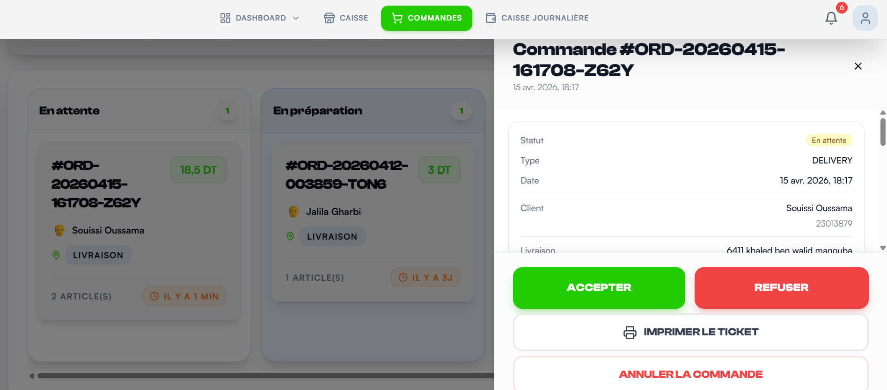

*Le client voit sa commande avec le statut "En attente", la barre de progression visuelle, le récapitulatif des articles et le mode de paiement.*

#### Commande en livraison — Suivi avec Ticket Restaurant

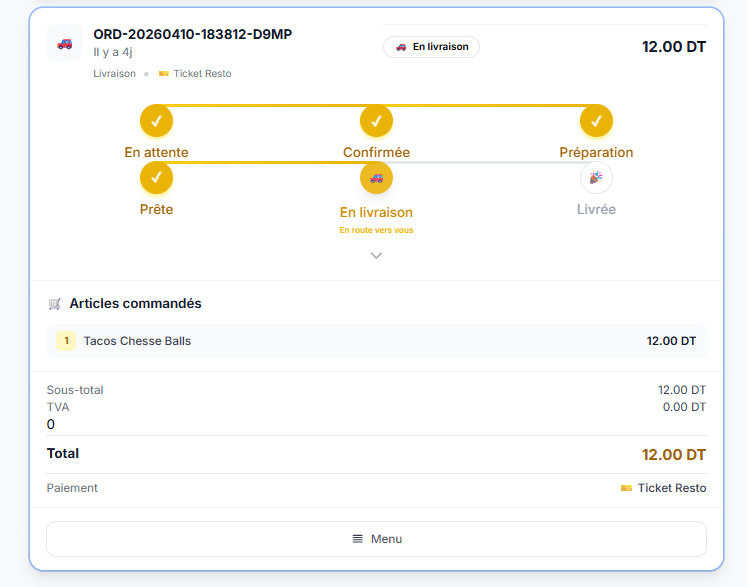

*Exemple d'une commande payée par Ticket Restaurant : la barre de progression montre "En route vers vous" et le mode de paiement affiche le badge 🎫 Ticket Resto.*

</details>

### 📊 Analytique et BI

- **Restaurant-level** : heures de pointe, rétention client (nouveaux vs récurrents), tendances revenus/AOV, performance produits
- **Platform-level** : MRR (Monthly Recurring Revenue), taux de churn, entonnoir de conversion (registered → active → paying), analyse de cohortes

### 📱 POS Mobile Offline-First

- **Fonctionnement sans réseau** : prise de commande complète en mode offline
- **Queue de synchronisation** avec retry exponentiel et catégorisation d'erreurs (transitoires vs permanentes)
- **Idempotence** : tokens d'idempotence pour éviter les doublons lors de la synchronisation
- **Sync batch** : envoi groupé des commandes accumulées offline

#### Flux de synchronisation offline

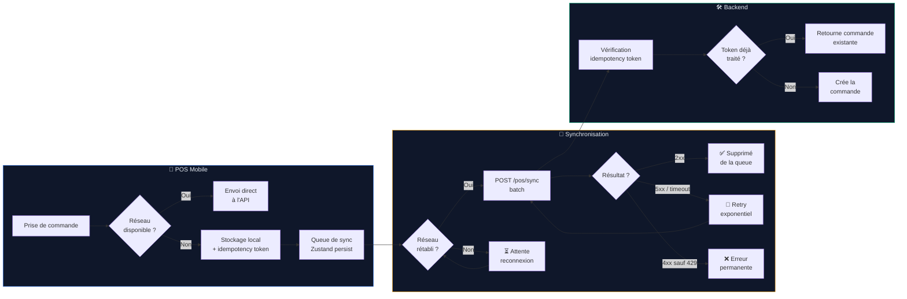
```mermaid
flowchart LR
    subgraph POS["📱 POS Mobile"]
        A["Prise de commande"] --> B{"Réseau\ndisponible ?"}
        B -->|"Oui"| C["Envoi direct\nà l'API"]
        B -->|"Non"| D["Stockage local\n+ idempotency token"]
        D --> E["Queue de sync\nZustand persist"]
    end

    subgraph Sync["🔄 Synchronisation"]
        E --> F{"Réseau\nrétabli ?"}
        F -->|"Oui"| G["POST /pos/sync\nbatch"]
        G --> H{"Résultat ?"}
        H -->|"2xx"| I["✅ Supprimé\nde la queue"]
        H -->|"5xx / timeout"| J["🔁 Retry\nexponentiel"]
        H -->|"4xx sauf 429"| K["❌ Erreur\npermanente"]
        J --> G
        F -->|"Non"| L["⏳ Attente\nreconnexion"]
        L --> F
    end

    subgraph API["🛠️ Backend"]
        G --> M["Vérification\nidempotency token"]
        M --> N{"Token déjà\ntraité ?"}
        N -->|"Oui"| O["Retourne commande\nexistante"]
        N -->|"Non"| P["Crée la\ncommande"]
    end

    style POS fill:#0f172a,stroke:#3b82f6,color:#e2e8f0
    style Sync fill:#0f172a,stroke:#f59e0b,color:#e2e8f0
    style API fill:#0f172a,stroke:#10b981,color:#e2e8f0
```

### 💰 Gestion de caisse

- **Sessions de caisse** avec ouverture/fermeture par utilisateur
- **Suivi des revenus** par session, agrégation automatique
- **Ventilation Espèces / Tickets** : le résumé de session affiche séparément le total encaissé en espèces et la valeur totale des tickets restaurant collectés
- **Badge par commande** : chaque commande de la session indique clairement son mode de paiement (💵 Espèces ou 🎫 Ticket Restaurant)

### 👥 Gestion client

- **Profils client** avec historique de commandes, favoris, moyens de paiement
- **Find-or-create** : création automatique du profil client à la première commande
- **Tickets support** : système de support intégré
- **Reçus PDF** : génération et téléchargement de reçus

---

## 👤 Rôles utilisateur et permissions

TNFood implémente une hiérarchie de rôles stricte au sein de chaque restaurant (tenant). Chaque rôle détermine les fonctionnalités accessibles et les actions autorisées.

### Hiérarchie des rôles

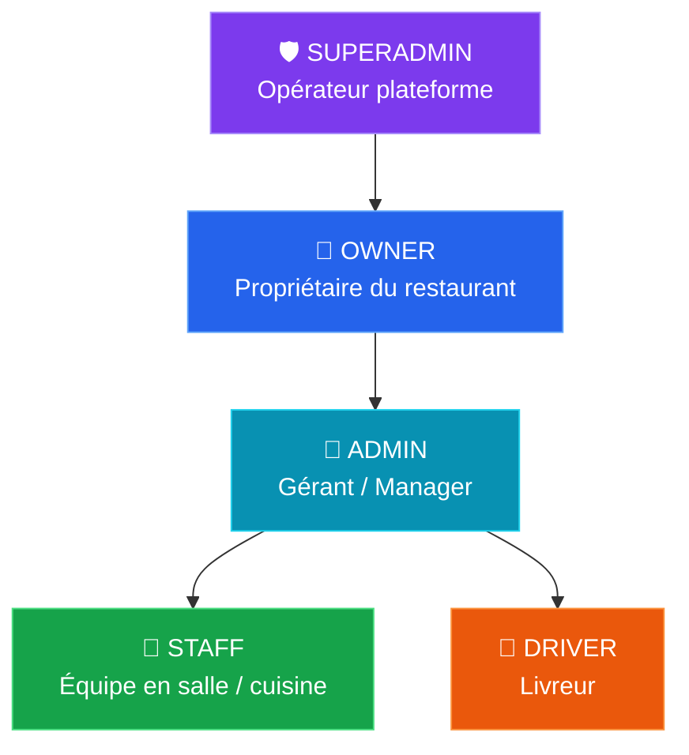
```mermaid
graph TD
    SA["🛡️ SUPERADMIN\nOpérateur plateforme"]
    OW["👑 OWNER\nPropriétaire du restaurant"]
    AD["🔧 ADMIN\nGérant / Manager"]
    ST["🍳 STAFF\nÉquipe en salle / cuisine"]
    DR["🚴 DRIVER\nLivreur"]

    SA --> OW
    OW --> AD
    AD --> ST
    AD --> DR

    style SA fill:#7c3aed,stroke:#a78bfa,color:#fff
    style OW fill:#2563eb,stroke:#60a5fa,color:#fff
    style AD fill:#0891b2,stroke:#22d3ee,color:#fff
    style ST fill:#16a34a,stroke:#4ade80,color:#fff
    style DR fill:#ea580c,stroke:#fb923c,color:#fff
```

### Matrice des permissions

| Fonctionnalité | OWNER | ADMIN | STAFF | DRIVER |
|---|:---:|:---:|:---:|:---:|
| **Dashboard & Analytique** | ✅ | ✅ | ❌ | ❌ |
| **Gestion du menu** (produits, catégories, suppléments) | ✅ | ✅ | ❌ | ❌ |
| **Gestion des commandes** (accepter, préparer, marquer prêt) | ✅ | ✅ | ✅ | ❌ |
| **POS / Caisse** (prise de commande en salle) | ✅ | ✅ | ✅ | ❌ |
| **Ouverture / Fermeture de caisse** | ✅ | ✅ | ❌ | ❌ |
| **Paramètres du restaurant** (infos, logo, thème) | ✅ | ✅ | ❌ | ❌ |
| **Configuration Ticket Restaurant** (nom, marge) | ✅ | ✅ | ❌ | ❌ |
| **Zones de livraison** | ✅ | ✅ | ❌ | ❌ |
| **Gestion des utilisateurs** (créer, modifier, supprimer) | ✅ | ❌ | ❌ | ❌ |
| **Assignation de livreur** | ✅ | ✅ | ❌ | ❌ |
| **Voir ses livraisons** | ❌ | ❌ | ❌ | ✅ |
| **Marquer une livraison comme livrée** | ❌ | ❌ | ❌ | ✅ |
| **Voir les détails de paiement** (mode + montant à collecter) | ✅ | ✅ | ✅ | ✅ |
| **Confirmer un paiement** (driver paid) | ✅ | ✅ | ❌ | ❌ |
| **Gestion des contacts / clients** | ✅ | ✅ | ❌ | ❌ |

### Détail des rôles

#### 👑 OWNER — Propriétaire

Accès total à toutes les fonctionnalités du restaurant. Le rôle OWNER est créé automatiquement lors de l'onboarding du restaurant sur la plateforme. C'est le seul rôle capable de gérer les utilisateurs (créer des comptes ADMIN, STAFF, DRIVER).

#### 🔧 ADMIN — Manager

Mêmes permissions que le OWNER sauf la gestion des utilisateurs. Idéal pour un gérant de confiance qui gère les opérations quotidiennes : menu, commandes, caisse, livraisons et paramètres.

#### 🍳 STAFF — Équipe

Accès limité aux opérations de terrain : prise de commande via le POS, gestion du flux de commandes (accepter → préparer → prêt). Le STAFF n'a pas accès au dashboard analytique, aux paramètres, ni à la gestion de la caisse.

#### 🚴 DRIVER — Livreur

Interface dédiée aux livraisons. Le livreur voit uniquement ses commandes assignées avec :
- L'**adresse de livraison** et les **coordonnées du client** (nom, téléphone cliquable)
- Le **mode de paiement** du client (Espèces ou Ticket Restaurant)
- Le **montant exact à collecter** : soit le total en espèces, soit la combinaison ticket + reste en espèces
- Le bouton **« Livré »** pour confirmer la livraison

<!-- Les captures d'écran de chaque interface sont intégrées dans la section "Captures d'écran / Visuels" ci-dessous -->

---

## 🎫 Paiement par Ticket Restaurant

TNFood intègre un système de paiement par **Ticket Restaurant** adapté au marché tunisien (Sodexo, Pluxee, etc.). Ce système permet aux clients de payer partiellement ou totalement avec des tickets, tout en assurant la traçabilité complète pour le restaurateur et le livreur.

### Principe de fonctionnement

Le restaurateur configure les types de tickets acceptés dans ses paramètres (ex : « Sodexo » avec une marge de 10%). La **marge** représente la commission prélevée par la société de tickets : un ticket de 20 DT avec une marge de 10% ne vaut que **18 DT** pour le restaurateur.

Le client choisit son mode de paiement au checkout et saisit librement le montant de son ticket. Le système calcule automatiquement :
- La **valeur effective** du ticket après déduction de la marge
- Le **reste à payer en espèces** si le ticket ne couvre pas la totalité

### Flux complet — De la configuration à la collecte

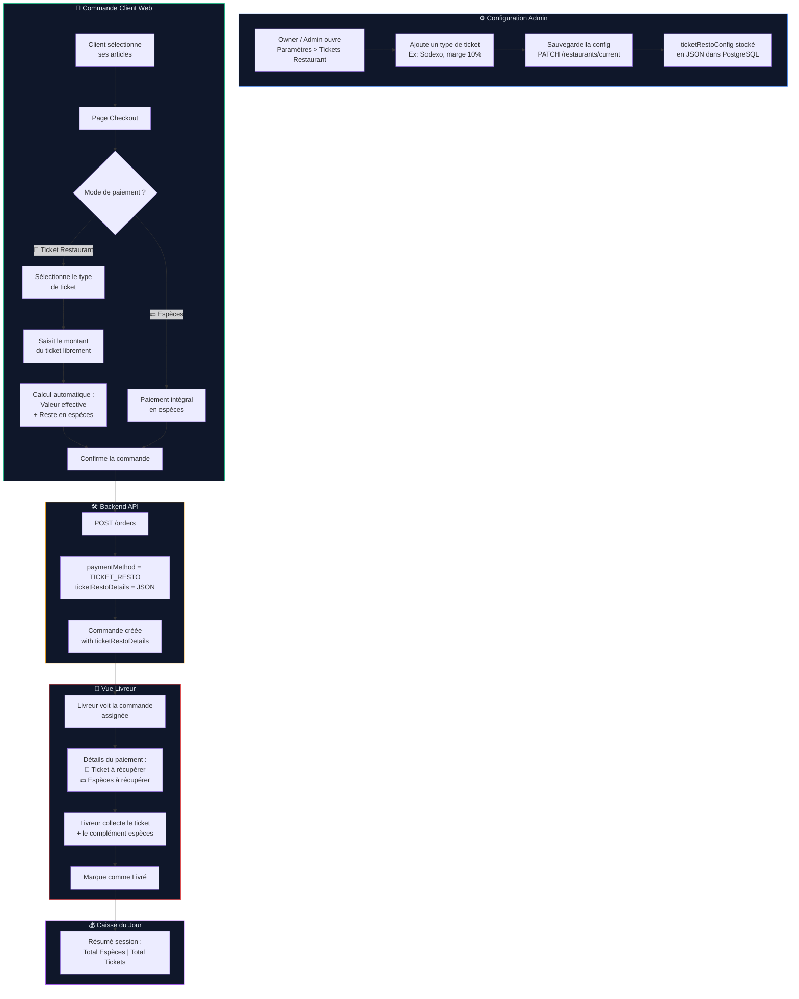
```mermaid
flowchart TD
    subgraph Admin["⚙️ Configuration Admin"]
        A1["Owner / Admin ouvre\nParamètres > Tickets Restaurant"] --> A2["Ajoute un type de ticket\nEx: Sodexo, marge 10%"]
        A2 --> A3["Sauvegarde la config\nPATCH /restaurants/current"]
        A3 --> A4["ticketRestoConfig stocké\nen JSON dans PostgreSQL"]
    end

    subgraph Client["🛒 Commande Client Web"]
        B1["Client sélectionne\nses articles"] --> B2["Page Checkout"]
        B2 --> B3{"Mode de paiement ?"}
        B3 -->|"💵 Espèces"| B4["Paiement intégral\nen espèces"]
        B3 -->|"🎫 Ticket Restaurant"| B5["Sélectionne le type\nde ticket"]
        B5 --> B6["Saisit le montant\ndu ticket librement"]
        B6 --> B7["Calcul automatique :\nValeur effective\n+ Reste en espèces"]
        B7 --> B8["Confirme la commande"]
        B4 --> B8
    end

    subgraph Backend["🛠️ Backend API"]
        B8 --> C1["POST /orders"]
        C1 --> C2["paymentMethod = TICKET_RESTO\nticketRestoDetails = JSON"]
        C2 --> C3["Commande créée\nwith ticketRestoDetails"]
    end

    subgraph Driver["🚴 Vue Livreur"]
        C3 --> D1["Livreur voit la commande\nassignée"]
        D1 --> D2["Détails du paiement :\n🎫 Ticket à récupérer\n💵 Espèces à récupérer"]
        D2 --> D3["Livreur collecte le ticket\n+ le complément espèces"]
        D3 --> D4["Marque comme Livré"]
    end

    subgraph Caisse["💰 Caisse du Jour"]
        D4 --> E1["Résumé session :\nTotal Espèces | Total Tickets"]
    end

    style Admin fill:#0f172a,stroke:#3b82f6,color:#e2e8f0
    style Client fill:#0f172a,stroke:#10b981,color:#e2e8f0
    style Backend fill:#0f172a,stroke:#f59e0b,color:#e2e8f0
    style Driver fill:#0f172a,stroke:#ef4444,color:#e2e8f0
    style Caisse fill:#0f172a,stroke:#a855f7,color:#e2e8f0
```

### Exemple concret

| Étape | Détail |
|---|---|
| **Config admin** | Ticket « Sodexo », marge 10% |
| **Client commande** | Total = 36 DT, paie avec ticket de 20 DT |
| **Calcul** | Valeur effective = 20 × (1 − 0.10) = **18 DT** |
| **Reste espèces** | 36 − 18 = **18 DT** |
| **Livreur collecte** | 🎫 Ticket Sodexo (20 DT) + 💵 18 DT en espèces |
| **Caisse** | +18 DT espèces, +20 DT tickets |

### Modèle de données

Les données Ticket Restaurant sont stockées en JSONB dans PostgreSQL :

- **`Restaurant.ticket_resto_config`** — Configuration des tickets acceptés :
  ```json
  [
    { "id": "1", "name": "Sodexo", "margin": 10, "isActive": true },
    { "id": "2", "name": "Pluxee", "margin": 12, "isActive": false }
  ]
  ```
- **`Order.ticket_resto_details`** — Détails du paiement par ticket pour chaque commande :
  ```json
  {
    "ticketName": "Sodexo",
    "ticketValue": 20,
    "margin": 10,
    "effectiveValue": 18,
    "cashRemainder": 18
  }
  ```

<details>
<summary>📸 Voir les captures d'écran — Paiement Ticket Restaurant</summary>

#### Checkout client — Choix du mode de paiement

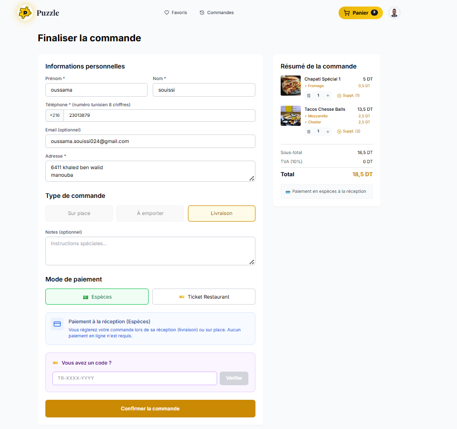

*Page de finalisation de commande côté client : le client choisit entre 💵 Espèces et 🎫 Ticket Restaurant. Le résumé de commande affiche les articles, suppléments, sous-total, TVA et total.*

#### Interface POS — Caisse

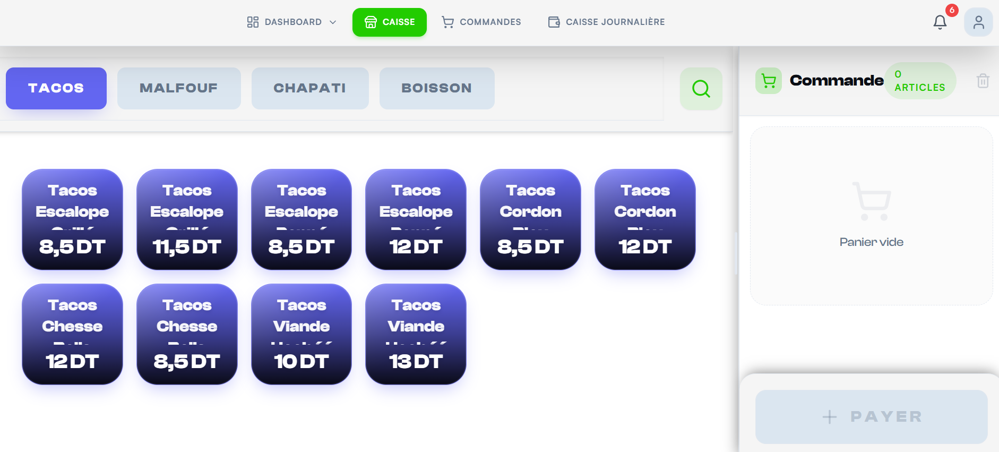

*L'interface caisse du dashboard admin affiche les catégories (Tacos, Malfouf, Chapati, Boisson), les produits avec prix, et le panier latéral pour la prise de commande en salle.*

</details>

---

## ⚡ Focus ingénierie

### Défis traités

| Défi | Approche |
|---|---|
| **Isolation multi-tenant** | RLS PostgreSQL + Tenant Interceptor + Repository Pattern — defense in depth sur trois niveaux |
| **Offline-first mobile** | Queue de synchronisation locale avec retry exponentiel, idempotence par token, catégorisation intelligente des erreurs |
| **Performance API** | Cache Redis stratifié (catégories 10min, produits 2min, restaurant 5min), rate limiting par endpoint |
| **Temps réel** | Architecture duale SSE + WebSocket selon le cas d'usage, scoped par tenant |
| **State machine commandes** | Transitions validées avec historique, empêchant les changements de statut incohérents |
| **Gestion des uploads** | Pipeline Cloudinary avec transformations automatiques, rollback en cas d'échec |
| **Auth multi-surface** | JWT pour admin/POS/platform, Clerk pour client web — stratégies adaptées à chaque surface |
| **Monorepo full-stack** | pnpm workspaces avec types partagés, builds Docker indépendants par service |

### Patterns d'ingénierie

- **Repository Pattern** : abstraction systématique de l'accès aux données, facilitant le testing et l'évolution du storage
- **Clean Architecture** : séparation stricte Controllers → Services → Repositories
- **DTO Pattern** : validation entrante (`class-validator`), formatage sortant standardisé (`BaseResponseDto`, `PaginatedResponseDto`)
- **Guard Pattern** : authentification et autorisation déclaratives via décorateurs
- **Interceptor Pattern** : injection transparente du contexte tenant
- **Event-driven** : notifications temps réel découplées de la logique métier
- **Idempotency** : tokens d'idempotence pour les opérations critiques (sync POS, création de commandes)

### Qualité et tests

- **+194 tests unitaires** couvrant repositories, services et controllers
- **Couverture globale** : ~75%
- **Mocking systématique** des repositories dans les tests unitaires
- **Exception handling standardisé** : filtres globaux (HTTP, Prisma, All Exceptions)
- **Documentation API** : Swagger/OpenAPI auto-générée avec 75+ endpoints documentés

---

## 📝 Notes d'architecture

### Choix du RLS vs database-per-tenant

Le choix de **Row-Level Security** plutôt que d'une base par tenant a été motivé par :

- **Coût opérationnel** : une seule base PostgreSQL à maintenir, sauvegarder et monitorer
- **Simplicité de déploiement** : pas de routing dynamique de connexion selon le tenant
- **Migrations unifiées** : un seul schéma Prisma, une seule pipeline de migration
- **Performance** : connection pooling unique, pas d'overhead de connexion par tenant
- **Scalabilité suffisante** pour le volume actuel et projeté de restaurants partenaires

Le compromis accepté est que l'isolation est **logique** et non physique — ce qui impose une rigueur constante sur le positionnement du contexte tenant avant chaque opération.

### Choix du monorepo

Le monorepo a été adopté pour :

- **Partager les types TypeScript** entre backend et frontends, évitant la désynchronisation des interfaces
- **Centraliser la configuration** (ESLint, Prettier, TypeScript)
- **Faciliter le développement local** : un seul clone, une seule commande `dev`
- **Maintenir la cohérence** des versions de dépendances via `overrides`

### Choix du offline-first pour le POS

L'application POS mobile est conçue en **offline-first** car :

- Les environnements de restauration en Tunisie ont une **connectivité variable** (coupures réseau, Wi-Fi instable)
- La prise de commande ne doit **jamais être bloquée** par un problème réseau
- La synchronisation utilise des **tokens d'idempotence** pour garantir l'intégrité des données après reconnexion

---

## 📦 Périmètre du dépôt

Ce dépôt public est un **showcase d'architecture**. Il contient :

| Inclus | Non inclus |
|---|---|
| ✅ Documentation d'architecture | ❌ Code source complet |
| ✅ Schémas et diagrammes | ❌ Fichiers de configuration avec secrets |
| ✅ Description des patterns et choix techniques | ❌ Variables d'environnement |
| ✅ Description des modules fonctionnels | ❌ Logique métier propriétaire |
| ✅ Stack technique détaillée | ❌ URLs d'infrastructure privées |
| ✅ Contexte de production | ❌ Dumps de base de données |

Le code source complet reste dans un dépôt privé. Ce dépôt public est maintenu comme référence technique et case study.

---

## 📸 Captures d'écran / Visuels

Voici un aperçu des différentes interfaces de la plateforme TNFood en production.

> **Note** : Les captures ci-dessous proviennent de l'environnement de production réel. Certaines données personnelles ont été masquées.

### 🛒 Checkout client — Finalisation de commande


*Le client final passe sa commande via le site web : formulaire d'informations, choix du type de commande (Sur place / À emporter / Livraison), mode de paiement (Espèces ou Ticket Restaurant), et résumé détaillé du panier.*

---

### 📊 Dashboard Admin — Gestion des commandes en temps réel


*Le dashboard affiche les commandes organisées par statut (En attente, En préparation). Le panneau latéral droit montre le détail complet d'une commande avec les boutons d'action **Accepter** / **Refuser**.*

---

### 🔄 Flux multi-acteur — Suivi simultané client & admin

<details>
<summary>Voir les 3 étapes du flux de commande (vues fusionnées client + admin)</summary>

#### Étape 1 — Commande confirmée : début de préparation


*À gauche : le client voit le statut passer à "Confirmée" dans sa barre de progression. À droite : le dashboard admin montre le sélecteur de livreur et le bouton "Lancer la préparation".*

#### Étape 2 — En préparation : commande en cuisine


*À gauche : le client voit "En cuisine" avec le détail de ses articles. À droite : l'admin voit le bouton "Commande prête" et peut imprimer le ticket.*

#### Étape 3 — En livraison : en route vers le client


*À gauche : le client voit "En route vers vous". À droite : l'admin voit le livreur assigné et le détail des articles avec suppléments.*

</details>

---

### 🚴 Assignation de livreur


*Lorsque la commande est prête, l'admin sélectionne un livreur disponible dans la liste déroulante. Le bouton indique "Assigner un livreur d'abord" tant que la sélection n'est pas faite.*

---

### 📦 Interface livreur — Livraison en cours


*L'interface dédiée aux livreurs (`/deliveries`) affiche : adresse de livraison, nom et téléphone du client (cliquable), montant à collecter, mode de paiement et bouton **Livré ✅**.*

---

### 🧾 Suivi commande — Côté client

| Commande en attente | Commande en livraison (Ticket Resto) |
|---|---|
|  |  |
| *Statut "En attente" avec barre de progression et récapitulatif.* | *Paiement par Ticket Resto avec barre de progression "En route vers vous".* |

---

### 📜 Historique des commandes — Côté client

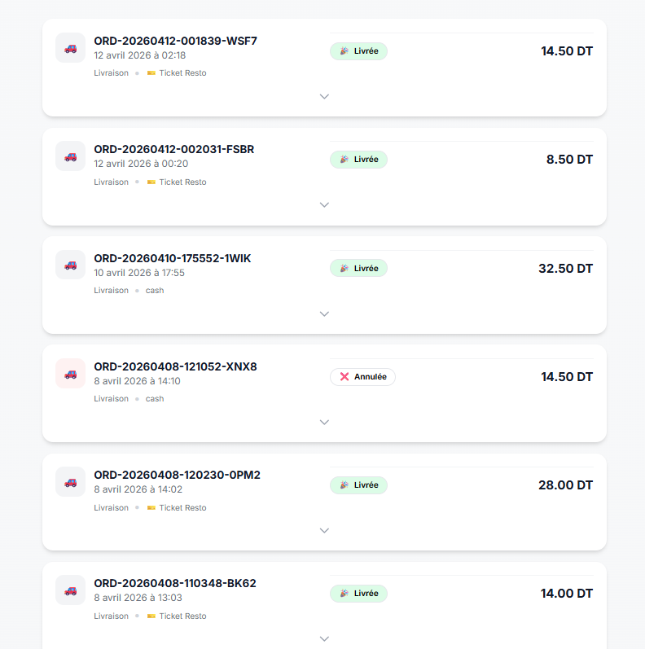

*Le client retrouve l'ensemble de ses commandes passées avec : numéro de commande, date, statut (Livrée ✅ / Annulée ❌), mode de paiement (cash ou Ticket Resto) et montant total.*

---

### 🏪 Interface POS — Caisse


*L'interface caisse permet la prise de commande rapide en salle : catégories en haut, grille de produits avec prix, et panier latéral avec compteur d'articles et bouton Payer.*

---

## 📚 Documentation complémentaire

Les documents suivants approfondissent les aspects spécifiques de l'architecture et de l'ingénierie du projet :

| Document | Description |
|---|---|
| [`docs/architecture.md`](./docs/architecture.md) | Architecture détaillée du backend — Clean Architecture, couches, modules, boot sequence |
| [`docs/multitenancy.md`](./docs/multitenancy.md) | Stratégie multi-tenant complète — RLS, fonctions SQL, helper `withTenant`, migration progressive |
| [`docs/features.md`](./docs/features.md) | Catalogue exhaustif des fonctionnalités par module (75+ endpoints, 18 modules backend) |
| [`docs/engineering-decisions.md`](./docs/engineering-decisions.md) | ADR (Architecture Decision Records) — choix techniques, trade-offs, justifications |
| [`docs/production-notes.md`](./docs/production-notes.md) | Notes de production — déploiement Docker, infrastructure, monitoring, leçons apprises |

---

## 🔗 Liens publics

| Ressource | Lien |
|---|---|
| **Site web** | [tnfood.tn](https://tnfood.tn) |
| **Contact** | resto.tn.contact@gmail.com |

### 👥 Équipe

| Profil | Développeur | Rôle | LinkedIn | GitHub |
|:---:|---|---|---|---|
|  | **Souissi Oussama** | Full-Stack Engineer | [](https://www.linkedin.com/in/oussama-souissi/) | [](https://github.com/oussa) |
|  | **Jouini Hamdi** | Full-Stack Engineer | [](https://www.linkedin.com/in/hamdi-jouini-7aa47828b/) | [](https://github.com/JHAMDI1) |

---

## ⚠️ Avertissement

Ce dépôt est publié à des fins de **documentation technique et de partage de connaissances**. Il ne constitue pas une invitation à reproduire le système dans son intégralité.

- Le code source complet de TNFood est **propriétaire** et hébergé dans un dépôt privé.
- Les informations présentées ici sont **volontairement abstraites** pour protéger la logique métier et les détails d'infrastructure sensibles.
- Aucun secret, clé API, URL d'infrastructure privée ou donnée exploitable n'est exposé dans ce dépôt.
- Les diagrammes et descriptions reflètent l'architecture réelle du système en production, sans en divulguer les détails d'implémentation.

---

<p align="center">
  <strong>Construit avec rigueur pour le secteur de la restauration tunisienne.</strong>
</p>

<p align="center">
  <sub>© 2025–2026 TNFood — Tous droits réservés. Maintenu par Souissi Oussama & Jouini Hamdi.</sub>
</p>
